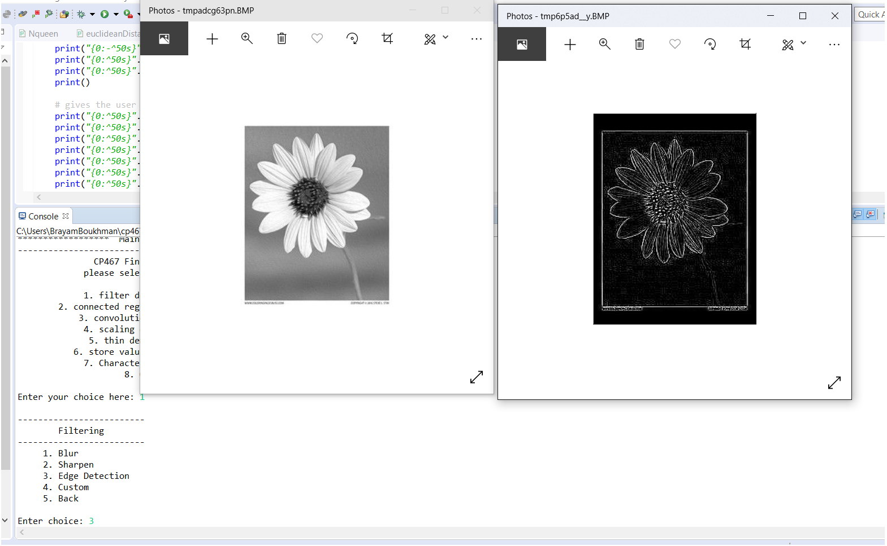
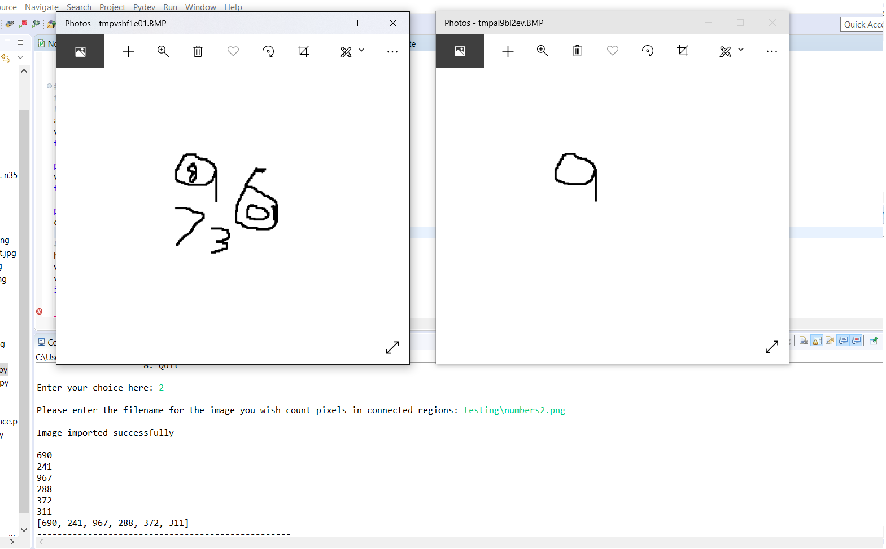
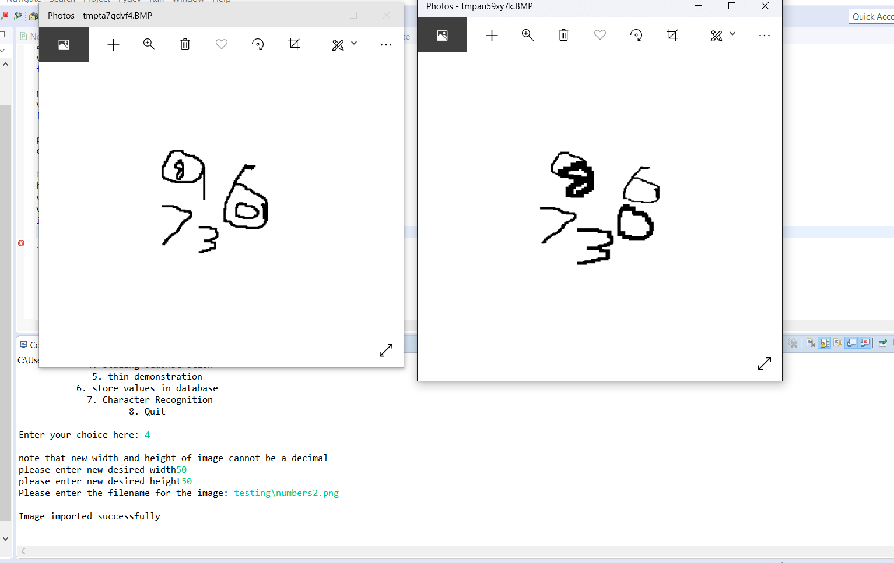
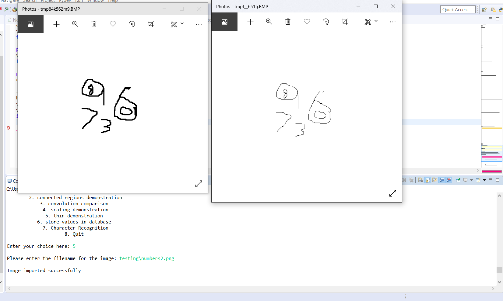
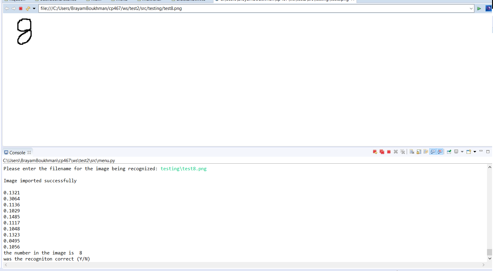

# Number_Recognition
This app aims to learn basic image editing techniques and features as listed below.

applying 3x3 filters; in the example below, I am using an edge-detection filter

finding the number of black pixels in each connected region, also returning those regions as separate images

scaling and image to certain dimensions; this can be done to a single image or every connected region in an image, as shown below 

thinning an image
         
  

This app also allows you to recognize numbers to a limited extent, using Euclidean distance and feature vectors. 

the image is converted into a feature vector. It is then compared to several other feature vectors of numbers whose value we already know, and whichever one has the smallest Euclidian distance is then predicted to be the number found in the image. 

to start the app, you have to run menu.py
from the option menu, you will be able to choose an operation
that you would like to perform, and then enter the address of the image file
you would like to use it on
